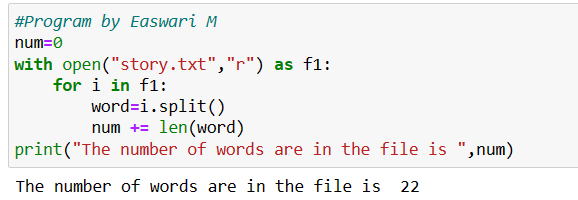

# Word-Count
## AIM:

To write a python program for getting the word count from a text.

## EQUIPEMENT'S REQUIRED: 
PC
Anaconda - Python 3.7

## ALGORITHM: 

### Step 1:
Create a new text file

### Step 2: 
 Add some sentence to the file

### Step 3: 

Now in the main.py file using split function,split the words in the .txt file

### Step 4:  

Count the splitted Words

### Step 5: 

Add the counted number in the variable

### Step 6: 

Run the program and display the results

## PROGRAM:
```
 program to find the number of words in a text file
 Developed by : Easwari M
Register number : 212223240033
num=0
with open("story.txt","r") as f1:
    for i in f1:
        word=i.split()
        num += len(word)
print("The number of words are in the file is ",num)
```
### OUTPUT:


## RESULT:
Thus the program is written to find the word count from a text.
